<div align="center">
    <table>
        <theader>
        <tr>
            <th>
            
            </th>
            <th>
            <span style="font-weight:bold;">UNIVERSIDAD LA SALLE</span><br />
            <span style="font-weight:bold;">FACULTAD DE INGENIERÍAS</span><br />
            <span style="font-weight:bold;">DEPARTAMENTO DE INGENIERÍA Y MATEMÁTICAS</span><br />
            <span style="font-weight:bold;">CARRERA PROFESIONAL DE INGENIERÍA DE SOFTWARE</span>
            </th>            
        </tr>
        </theader>
    </table>
</div>

<table>
    <theader>
        <tr>
        <th colspan="2">INFORMACIÓN BÁSICA</th>
        </tr>
    </theader>
    <tbody>
        <tr>
            <td>ALUMNO:</td>
            <td>Roger Infa Sanchez y .</td>
        </tr>
        <tr>
            <td>CURSO:</td>
            <td>Computación Distribuida y Paralela</td>
        </tr>
        <tr>
            <td>DOCENTE:</td>
            <td>Renzo Mauricio Rivera Zavala  - rriveraz@ulasalle.edu.pe</td>
        </tr>
        <tr>
            <td>TAREA:</td>
            <td>Sistema de recomendación de Películas Spark </td>
        </tr>
        <tr>
            <td>DESCRIPCION:</td>
            <td>Crear una aplicación Spark que genere un sistema de recomendación de películas mediante el filtrado colaborativo. La aplicación debería poder recomendar películas a los usuarios en función de sus clasificaciones de películas.</td>
        </tr>
        <tr>
            <td colspan="2">RECURSOS:</td>
        </tr>
        <tr>
            <td colspan="2">
                <ul>
                <li><a href="https://sparkbyexamples.com/pyspark/spark-submit-python-file/?expand_article=1">How to Spark Submit Python | PySpark File (.py)?</a></li>
                <li><a href="https://spark.apache.org/docs/latest/">Documentacion de Spark</a></li>
                <li><a href="https://github.com/rescobedoulasalle/git_github/blob/main/ulasalle.png?raw=true">Logo La Salle</a></li>
                <li> Maquina Virtual proporcionada mediante Clasroom.
                </ul>
            </td>
        </tr>
    </tbody>
</table>

## Clonacion de maquinas virtuales y verifiacion adaptador NET

Las maquinas vituales son **Spark_Master_Node** y **Spark_Worker_Node1**
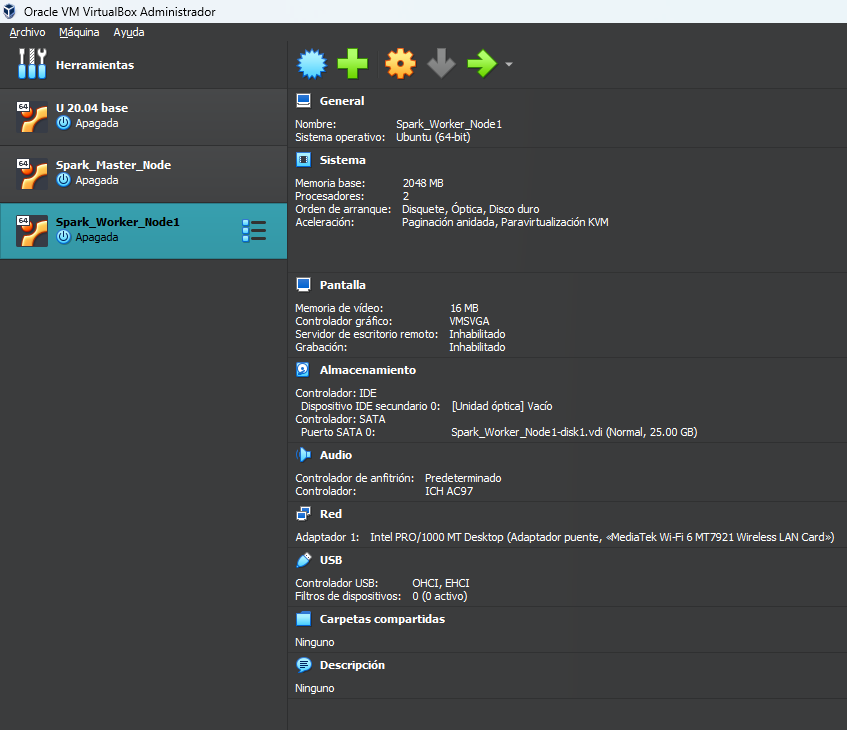
Posterior verifiacremos sus adaptadores de red, primero de **Spark_Master_Node**
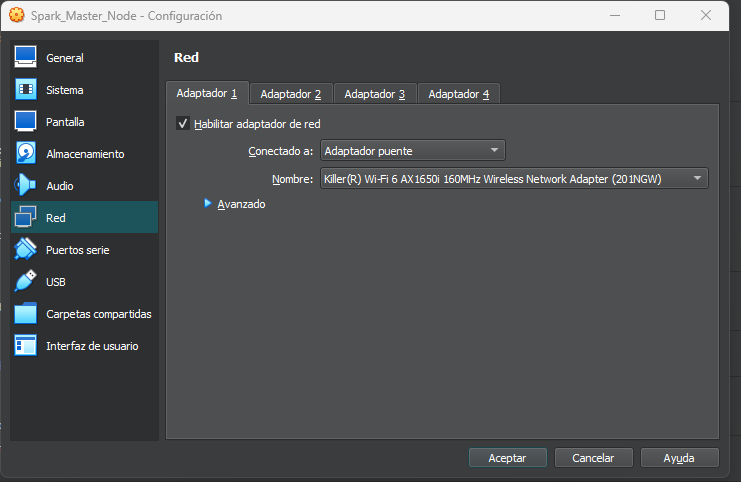
Y luego de **Spark_Worker_Node1**
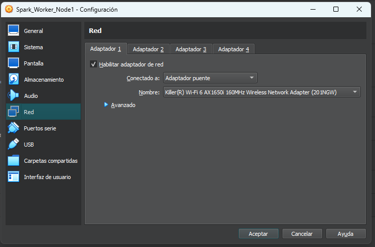
Esto para que cada maquina virtual tenga su propia IP

## Cambiar nombre de host de la maquina clonada (Spark_Worker_Node1)

Para cambiar el nombre del Host se debe ejecutar en consola:

```bash
hostnamectl set-hostname worker1
```

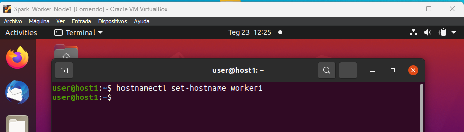

## Verificar variables de entorno en ambos nodos:

Primero en **Spark_Master_Node**
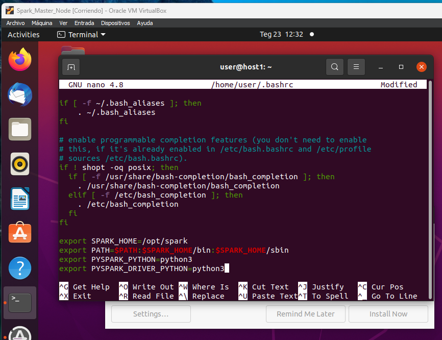
Luego en **Spark_Worker_Node1**
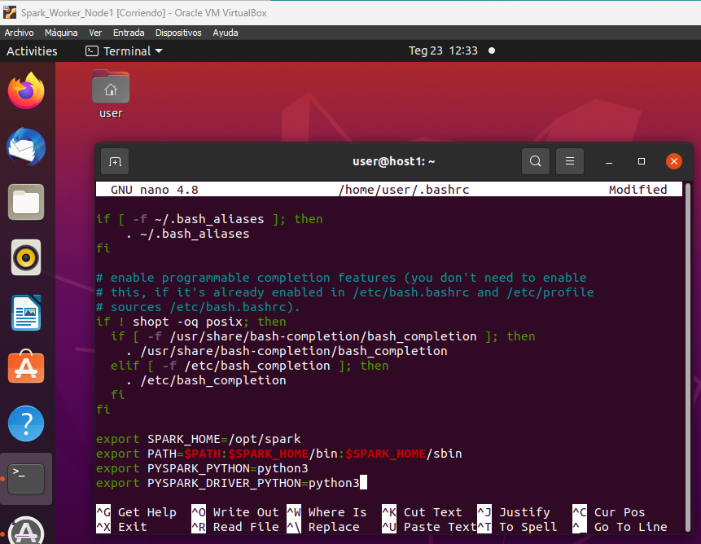

Y ejecutamos para verificar

```bash
source ~/.bashrc
```

## Configurar archivo de ambiente de Cluster de Spark (solo Master Node)

Ejecutamos

```bas
nano $SPARK_HOME/conf/spark-env.sh
```

y agregaremos las siguientes lineas

```bash
export SPARK_MASTER_HOST=&lt;Direccion IP de nodo master&gt;
export SPARK_MASTER_PORT=7077
export SPARK_WORKER_INSTANCES=1
export SPARK_WORKER_CORES=2
export SPARK_WORKER_MEMORY=2g
export SPARK_WORKER_PORT=8888
```

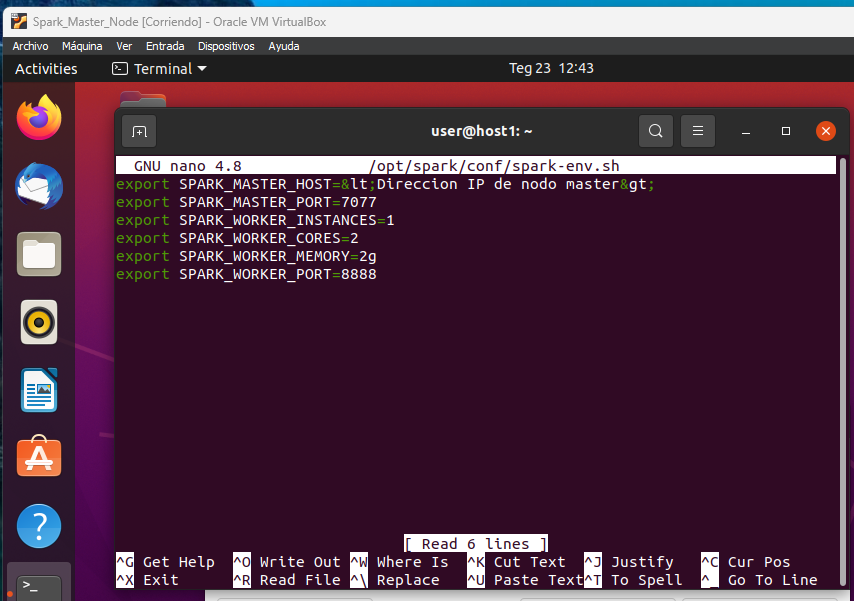

## Verificar o crear archivo de configuración de Spark (solo Master Node)

Para este paso necesitaremos conocer la IP de la maquina, pondremos

```bash
ip addr show
```

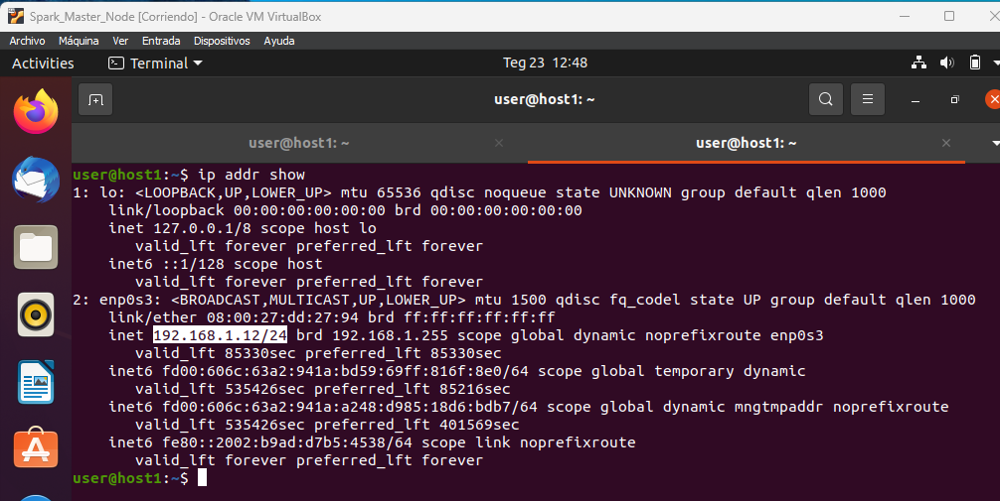
En este caso la IP de **Spark_Master_Node** es **192.168.1.12**

Ejecutamos en Master

```bas
nano $SPARK_HOME/conf/spark-defaults.conf
```

y agregaremos la siguiente linea

```bash
spark.master spark://192.168.1.12:7077
```

## Iniciar nodo maestro (solo Master Node)

Ejecutamos

```bas
start-master.sh
```

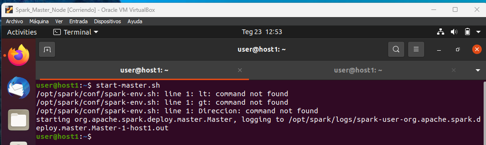

## Verificar funcionamiento de nodo maestro (solo Master Node)

En el buscador ponemos la direccion ip del servidor y nos aparece una interfaz web que indica si todo esta bien configurado , en este caso ponemos

```bas
http://192.168.1.12:8080/
```

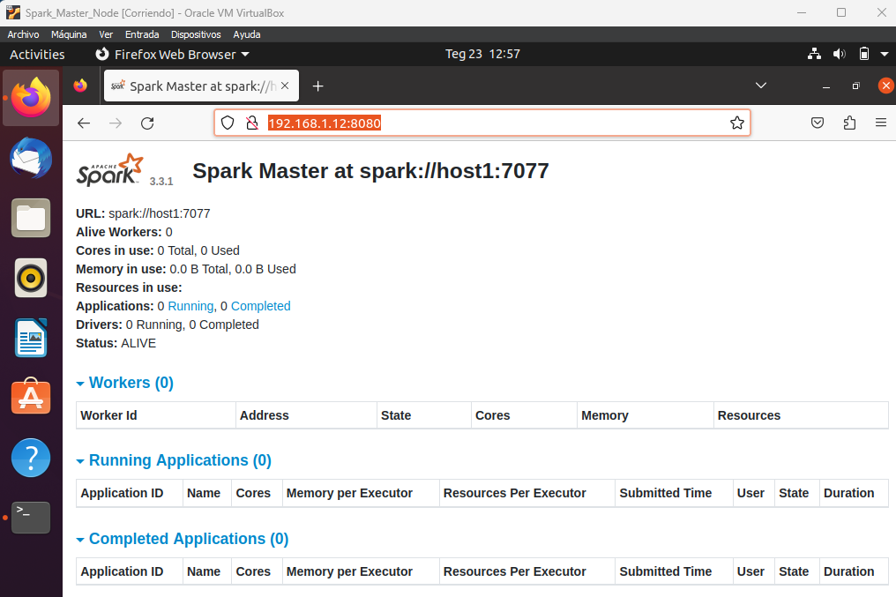

## Iniciar nodo worker en maquina clonada (solo Worker Node)

En **Spark_Worker_Node1** podremos este comadno

```bas
start-worker.sh spark://192.168.1.12:7077
```

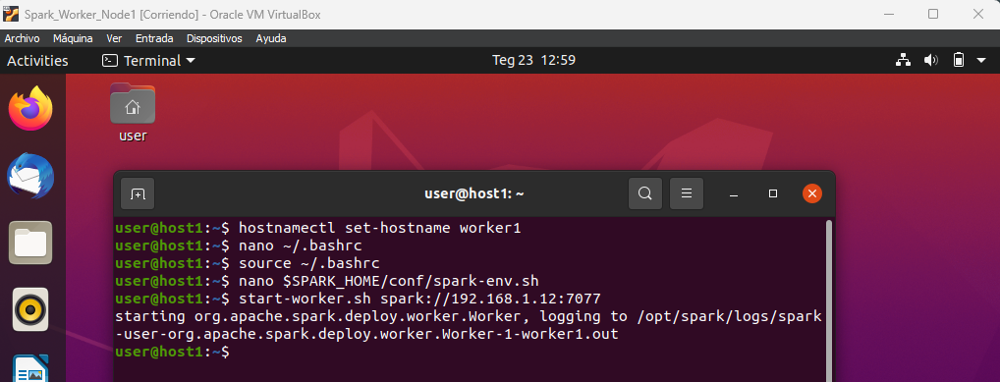

Y lo compromabos en el master node
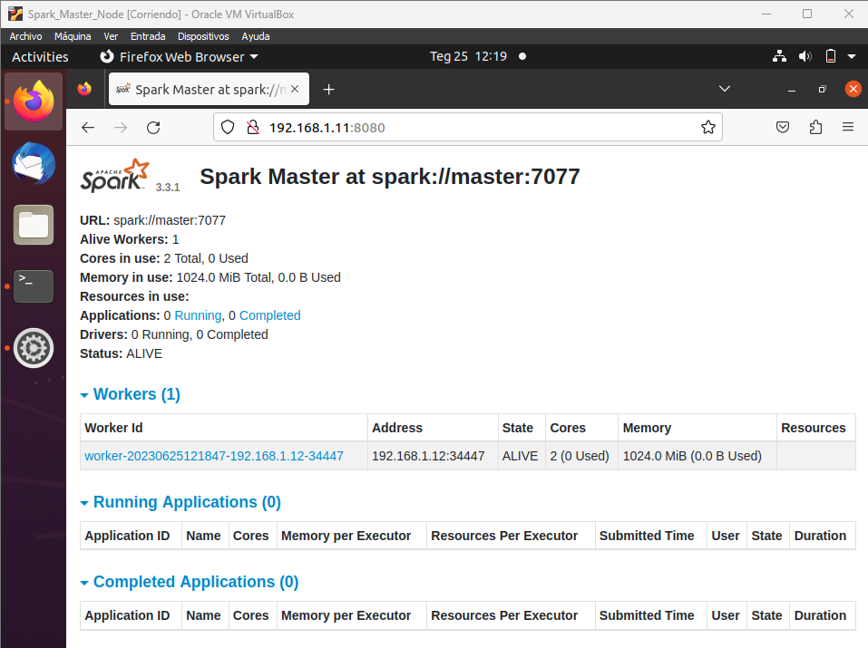

Aparece como worker

## Codigo en python para la recomendación

```python
from pyspark.sql import SparkSession
from pyspark.ml.evaluation import RegressionEvaluator
from pyspark.ml.recommendation import ALS
from pyspark.sql.functions import col
import sys

def load_movie_data(spark, filepath):
    return spark.read.csv(filepath, header=True, inferSchema=True)
```

En estas primeras líneas, se importan las clases y funciones necesarias de la biblioteca PySpark para el procesamiento de datos distribuidos y recomendaciones. Además, se importa el módulo sys para obtener argumentos de línea de comandos. La función **load_movie_data** carga los datos de películas desde un archivo CSV utilizando Spark y retorna un DataFrame.

```python
def train_als_model(data):
    als = ALS(userCol="userId", itemCol="movieId", ratingCol="rating", coldStartStrategy="drop")
    model = als.fit(data)
    return model
```

La función **train_als_model** entrena un modelo ALS (Alternating Least Squares) utilizando los datos de películas proporcionados. Se crea una instancia de **ALS** especificando las columnas correspondientes a los usuarios, películas y clasificaciones, y se ajusta el modelo a los datos de entrada.

```python
def evaluate_model(model, test_data):
    predictions = model.transform(test_data)
    evaluator = RegressionEvaluator(metricName="rmse", labelCol="rating", predictionCol="prediction")
    rmse = evaluator.evaluate(predictions)
    return rmse
```

La función **evaluate_model** evalúa el rendimiento del modelo entrenado utilizando un conjunto de datos de prueba. Primero, se generan predicciones para el conjunto de prueba utilizando el modelo. Luego, se utiliza un evaluador de regresión (**RegressionEvaluator**) para calcular la métrica de evaluación, en este caso, el RMSE (Root Mean Square Error).

```python
def recommend_movies(model, user_id, num_recommendations):
    user_recs = model.recommendForUserSubset(user_id, num_recommendations)
    return user_recs
```

La función **recommend_movies** genera recomendaciones de películas para un usuario específico utilizando el modelo entrenado. Se utiliza el método recommendForUserSubset para obtener las principales recomendaciones para el usuario especificado y se retorna un DataFrame con las recomendaciones.

```python

if __name__ == "__main__":
    spark = SparkSession.builder.appName("MovieRecommender").getOrCreate()

    movie_data = load_movie_data(spark, "movies.csv")

    (training_data, test_data) = movie_data.randomSplit([0.8, 0.2])

    model = train_als_model(training_data)

    rmse = evaluate_model(model, test_data)
    print(f"RMSE: {rmse}")

    user_id = int(sys.argv[1]) if len(sys.argv) > 1 else 1
    num_recommendations = 5
    recommendations = recommend_movies(model, user_id, num_recommendations)

    print(f"Recomendaciones para el usuario {user_id}:")
    recommendations.show(truncate=False)

    spark.stop()
```

En el bloque principal del programa, se crea una sesión de Spark utilizando **SparkSession**. A continuación, se carga el conjunto de datos de películas desde un archivo CSV utilizando la función **load_movie_data**. Los datos se dividen en conjuntos de entrenamiento y prueba.

Luego, se entrena el modelo ALS llamando a la función **train_als_model** con los datos de entrenamiento. El rendimiento del modelo se evalúa utilizando la función **evaluate_model** en los datos de prueba y se imprime el valor del RMSE.

A continuación, se define un ejemplo de recomendaciones para un usuario específico. El ID del usuario se puede proporcionar como argumento de línea de comandos, de lo contrario, se utiliza un valor predeterminado. Se llama a la función **recommend_movies** para obtener las recomendaciones y se imprimen en pantalla.

Finalmente, se detiene la sesión de Spark llamando al método stop().
Este es el codigo completo:

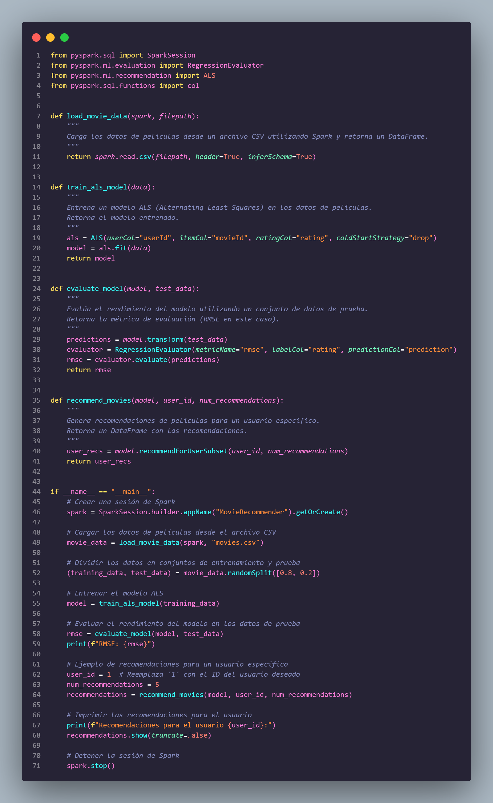
